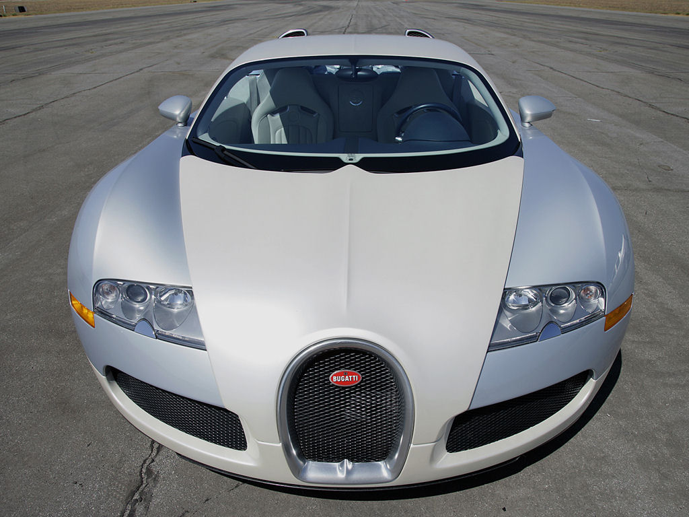
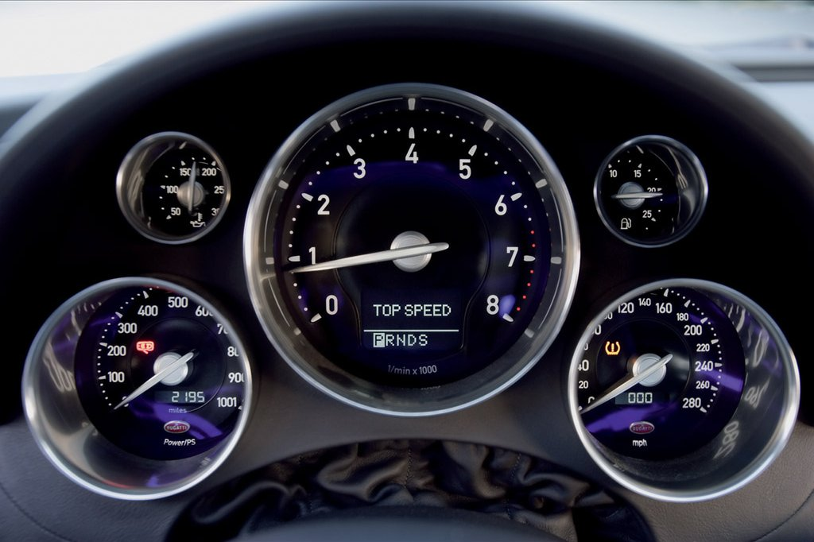

Her şey sadece bir hayal sayesinde gerçekleşti. Bugatti Veyron’u sadece bir kişi hayal etti. Dünyanın gelmiş geçmiş en hızlı ve en gelişmiş otomobilinin ortaya çıkışı ve ilk tasarımı VW eski başkanı Ferdinand Piech’nin 1998 senesinde Bugatti markasını satın alırken aynı zamanda hayallerini de satın almış olması ile başladı. Otomobil ilk kez 2000 Paris otomobil fuarındaki standında hayranlarının bakışları ile buluştu. Kısa bir süre sonra ise Volkswagen, Bugatti Veyron’un seri üretime geçeceğini ve 1.000.000.- Euro’ya satılacağını duyurdu. 2000 senesinde tasarımı belirginleşen otomobil için verilen teknik rakamlar Bugatti’nin F1 yarış otomobillerini caddede geçebilecek ilk ve tek canavar olduğunun habercisiydi. Rakamlar 1001 HP güç ve saatte 407 km/s’yi işaret ediyordu. Ancak sıra dışı özellikler ve üretim zamanının kısa tutulması bazı sorunları da beraberinde getirmeğe başladı. Mühendisler bu güçteki bir otomobilin prototipini yapmanın kağıt üzerindeki tasarımını yapmaktan daha bunaltıcı olacağından emindiler. Nitekim öyle oldu. Yaklaşık bir buçuk senelik başarısız denemelerden sonra 2003 yılında Dr. Wolfgang Schreiber, Bugatti’ye baş mühendis olarak getirildi. O sıralarda Ferdinand Piech VW’dan ayrıldı. Yerine yeni yönetici Bernd Pischetsrieder geçti. Schreiber ve mühendisleri Veyron’da yaklaşık 600 kadar sorun tespit ettiler. Daha önemlisi 1001 HP güç üretmesi öngörülen motor yalnızca 600 HP güç üretiyordu. Otomobilin dış görünümünü ve formunu değiştirmeden işe başlamak gerekiyordu. Bernd Pischetsrieder firmanın finansal problemini çözerken Schreiber ve ekibi 1001 HP gücü ve 407 km/s’yi düşünmeğe başlamıştı. İki yıl içerisinde otomobilin sürüş dinamiklerini ve tüm bileşenlerini %95 oranında değiştirmeği başardılar. Artık Ferdinand Piech’in tüm hayalleri gerçekleşmişti.

Otomobilin kalbindeki W16 (çift V8) ve 1001 HP güç üreten motorda toplam 4 turbo kompresör bulunuyor. 64 sübap motorda 2 soğutma sistemi kullanılmış. Sistemin biri motoru soğuturken diğeri kompresöre giden havayı soğutuyor. Hafif metal alaşım W16, VR prensibine uygun ve birbirine 90 derece açı yapan iki adet V8 motordan oluşturulmuş. Aslında otomobilin gerçek gücü ideal koşullarda (Yüksek oktan yakıt, deniz seviyesi, sıcaklık ve nem şartları) 1100 HP güce ulaşıyor. Volkswagen bir benzeri daha olmayan motorun denemelerini 16 silindir olmayan diğer bazı modellerindeki testlerinden sonra kullanmaya karar vermiş. 4 turbolu motorlar monte edilmeden önce 6500 d/d’daki kırmızı çizgide 8 saat süreyle test ediliyor. Radikal ve son derece saldırgan çizgilere sahip otomobile can veren motordaki turboların çalışması için içeri giren hava 130 santigrat dereceye kadar soğutulduktan sonra motorun yanma odasına gidiyor. Turbo kompresörün içinden geçen basınçlı hava ısınıyor ve genleşiyor. Soğutulmuş hava motora daha çok oksijen basılmasına yarıyor. İçeri giren oksijen miktarının artması ise yanma kalitesini artırarak yüksek beygir gücü oluşturuyor. Egzos gazı sıcaklığının 1000 santigrat derece olduğu düşünülürse Bugatti mühendislik başkanı Dr. Wolfgang Schreiber ile yapılan söyleşinin önemi ortaya çıkıyor. Schreiber’e göre “ivmelenme için 1000 HP’lik mekanik güç üretmek üzere 3000 HP’lik yakıt tüketiliyor. Soğutma ile egzos  sistemleri birlikte olarak 2000 HP tüketiyor. Çünkü, benzin motorlarının verimliliği %33 ile %35’tir. Böylelikle enerjinin üçte ikisi soğutmaya ve egzos sistemlerine gidiyor.” Bu sadece Veyron W16 için değil tüm benzinli motorlar için geçerli. Veyron’da ise çok daha büyük rakamlar söz konusu. Otomobilin soğutma sisteminde 40 litre su dolaşıyor. Sistemde dolaşan su 10 adet radyatörü ısıtırken, aşırı yüksek gücün ısınma problemlerine neden olmaması için radyatörlerin tasarımı yeniden yapılandırılmış. 

Otomobildeki yeni tasarım DSG vites kutusu Veyron’un en önemli silahlarından birisi. Karmaşık ayarlar gereken aktarma sistemi bütün gücü ve torku kayıpsız olarak tekerleklere iletmek sorunda. Şanzımanın son derece sağlam olması gerekiyor. DSG çift debriyajlı şanzıman Volkswagen tarafından zaten kullanılıyordu. Ancak Bugatti’nin asgari bir McLaren F1’in karşı karşıya kaldığı çekiş kuvvetine dayanması söz konusu olunca otomobilin DSG şanzımanı İngiltere’deki Ricardo Engineering firmasında geliştirilip sağlamlaştırıldı. DSG şanzıman Haldex debriyajlı ve geliştirilmiş 4 çeker sürüş sistemini içeriyor. Haldex transmisyon maksimum yol tutuş için her tekerleğe farklı bir çekiş uyguluyor. Yedi vitesli ve çift kavramalı şanzıman dünyada şu ana kadar yapılmış en hızlı vites değiştiren vites kutusu. DSG vites kutusunda biri tam otomatik diğeri ise sıralı iki mod bulunuyor. Ricardo firması vites değişimlerini vites kolu ile veya direksiyon arkasındaki kulaklarla gerçekleştirmeyi sağlamış. Sistemin F1 otomobillerinden hiçbir farkı yok.

Audi rüzgar tünelleri otomobilin aerodinamik formu için Dr. Schreiber tarafından sıkça kullanılmış. Veyron’da bir taraftan sürücü ve yaya güvenliği sağlanmaya çalışılırken diğer taraftan bir F1 otomobiline oranla sürtünmenin azaltılması gerekiyordu. Aksi halde hedefteki 407 km/s’lik hıza ulaşmak mümkün değildi. Formula 1 aerodinamik tasarımında aşağı doğru bastırılan hava akışı otomobili piste yapıştırarak yüksek hızlarda yoldan çıkmasını engeller. Buradaki sorun Veyron’un 1900 kg’lık ağırlığı ve gövde yüksekliğiydi. Mühendislerin güvenli sürüş için yol tutuşunu sağlaması ve yüksek hızlardaki kaldırma kuvvetinden optimum yararlanması gerekiyordu. Böylesine yüksek hızlara ulaşabilen süper otomobillerin güvenli ve kolaylıkla kullanılabilen türde olmaları beklenir. Sorun otomobilin altına yerleştirilen hava dağıtım kanalları, katlanılabilir spoyler ve üç farklı ayarlı süspansiyonların kullanımı ile aşıldı. Elektro-hidrolik kontrollü süspansiyonlarda Standard, Handling ve Maksimum hız olmak üzere üç yükseklik ayarı bulunuyor. Bu ayarlar sürate göre ikinci bir anahtar ile açılıyor. Veyron’da maksimum sürate ulaşmak için,  önce otomobili durdurmak ve sürücü tarafındaki kilide frene basılı olarak ikinci anahtarı yerleştirmek gerekiyor. Sürüş yüksekliğinin azaldığı bu durumda otomobil 200 km/s’ye ulaştığı an kanatlar otomatik olarak devreye giriyor. Kanatlar açıkken maksimum sürat 372 km/s olarak verilmiş. Standart sürüşte otomobil yoldan 125 mm yüksekte ve gövde altı kanatçıkları açık, arka spoyler katlanmış pozisyonda gidiyor. Veyron’un sürati 220 km/s’yi geçtiğinde Handling  moduna geçen sistem yüksekliği önde 80 mm arkada ise 90 mm’ye indiriyor. BU moda arka spoyler otomatik olarak açılıyor ve 200 kg’lık yere basma gücü (down-force) oluşuyor. Sürücünün frenleme dozlarına göre uçaklardaki flaplar gibi spoylerlerin konumları değişiyor ve frenlemeye yardımcı oluyor. Ancak üçüncü ve son seçenek olan maksimum hız modunda Veyron’un yüksekliği önde 65 mm arkada ise 70 mm’ye kadar düşüyor. Mühendisler bu modda otomobilin hız sınırını denemek için sadece düz yolların tercih edilmesi gerektiğini önemle vurguluyorlar. Modun diğer bir özelliği ise arka spoylerlerin katlanarak yere bastırma gücünden vazgeçmesi. Bu durumda hava dağıtım kanatçıkları sürtünmeyi azaltmak amacıyla kapalı konuma geçiyor. Veyron bu moda 0-100 km/s’e 2.46 saniyede, 407 km/s’e ise 55 saniyede ulaşıyor. Monoblok karoseri F1 teknolojisi olan Karbon-Fiber’den üretilmiş. Burulmalara son derece dayanıklı karoser değişken sürüş yüksekliklerinde dahi sürtünmeyi azaltıyor.  Bugün için bu otomobille karşılaştırılabilecek tek rakip, bio-etanol ile çalışan Koenigsegg CCXR Edition. 

Bugatti Veyron’un yola yapışmasındaki en büyük pay şüphesiz ki lastikler. Otomobilin üzerinde Volkswagen’in sipariş ettiği özel üretim Michelin lastikler kullanılıyor. Firma Michelin’den kar,  çamur, yağmur, viraj ve yüksek hızla mutlak tutunmanın sağlandığı bir lastik geliştirmesini istemiş. Michelin, Veyron için özel olarak geliştirdiği (Isı ve kayma direnci özel) lastikleri kullanmış. Lastik patlasa dahi 90 km/s hızla 200 km gidebiliyor. Yedek lastik için ekstra ağırlığın gerekmediği Michelin Pilot Sport PAX lastiklerin direnci Standard lastiklerden %15 daha iyi ve şimdiye kadar üretilmiş en kalın lastikler. Otomobilin dev karbon-seramik fren disklerinde ise uzay teknolojisinden alınma titanyum pistonlu 8 kumpas bulunuyor. Otomobili frenlemek için dünyanın en büyük seramik fren diskleri kullanılmış. Seramik frenler 400 mm, 8 pistonlu AP yarış kumpası. 100 km/s panik frenlemede 31.4 metre gibi mükemmel bir mesafede durabilen Veyron’un fren performansı da diğer sürüş değerleri gibi müthiş.

Otomobilin kontrol panelleri eski ve yeni formların bütünleşmesini yansıtıyor. Koltuklar karbon-fiber’den yapılmış ve deri kaplı. Ön panelde içerideki estetiği bütünleştirmek amacı ile son derece nadir olan magnezyum-alüminyum karışımı bir ambians yaratılmış. Aynı alaşımdan kullanılan kumanda düğmelerinin tanesinin 4500 pound olması içerideki konfor ve özeni göstergesi olarak karşımıza çıkıyor. Baştan çıkarıcı kabin son derece ayrıcalıklı. Otomobil start düğmesi ile çalışıyor. Alüminyum-magnezyum direksiyon yumuşak deri kaplı.

Bitmek tükenmek bilmeyen hız tutkusunu tatmin edebilecek ve paranın satın alabileceği en gelişmiş otomobil olan Veyron, Bugatti bantlarında senede 50 adet olmak üzere 300 otomobil üretilecek. Büyük bir ihtimalle üretilen otomobillerden ayrıdan fazlası kullanılmadan koleksiyonlarda ya da müzelerde saklanacak. 

Yolların gördüğü en acımasız makine, büyük bir fiziksel mücadele ile yer çekimine karşı koyuyor. Veyron sürücüsünün tam olarak hazır olmadan kullanamayacağı bir otomobil. Dikkat unsurunun ön plana çıktığı sürüş esnasında anlık sürüş girdileri ile otomatik hesaplaşma yapabilecek bir zihne ihtiyaç duyuluyor. Sürücünün bir bellek uzmanı ve zihin mücadelesine haiz bir yetenekte olması şart.

Bugatti Veyron:

* 0-96 km/s		: 2.46 s
* 0-200 km/s		: 7.3 s
* 0-320 km/s		: < 20 s
* Maksimum hız	: 407 km/s
* Güç			: 1001 HP, 6000 d/d
* Tork			: 1250 Nm, 2200-5500 d/d
* Güç/Ağırlık		: Ton başına 530 HP
* Co2 emisyonu		: 474 g/km
* Motor			: W şeklinde 16 silindir 7993 cc
* Yerleşim		: Ortada uzunlamasına
* Çekiş			: 4x4
* Güç/Hacim		: Litre başına 125 HP
* Şanzıman		: 7 ileri DSG
* Şehir içi		: 40.9 litre / 100 km
* Şehir dışı		: 14.7 litre / 100 km
* Ortalama		: 24.1 litre / 100 km
* Menzil			: 403 km
* Ön frenler		: 400 mm karbon disk
* Arka frenler		: 380 mm seramik disk
* Lastikler ö/a		: 265 ZR, 365 ZR (PAX) Michelin

